# 🏏 Pocket Score

> **Box Cricket Scoring — Reimagined.**

**Pocket Score** is a sophisticated, high-performance cricket scoring application meticulously crafted for the box cricket ecosystem. It adopts a premium **"Midnight Studio"** design philosophy, blending professional-grade analytics with a cinematic dark-mode interface. From squad building to the final result screen, every interaction is designed to feel premium and fluid.

---

## ✨ Key Features

| Feature | Description |
|---|---|
| 🏆 **Midnight Studio UI** | Stunning dark-mode design with Outfit font and fluid micro-animations |
| ⚡ **Pro Scoring Engine** | Ball-by-ball tracking with 4s, 6s, wides, no-balls, free hits & all wicket types |
| 🎉 **Live Event Animations** | Full-screen FOUR!, SIX!, and OUT! celebration overlays with confetti |
| 🔄 **Auto-Persistence** | Powered by `HydratedBloc` — your progress is never lost |
| 📊 **Career Analytics** | Track strike rates, averages, and economy rates across all matches |
| 📋 **Match History** | Revisit every game with high-fidelity scorecards |
| 🎯 **Smart Match Flow** | Squad → Team Selection → Lineup Preview → Toss → Openers → Score |

---

## 🚀 Getting Started

### Prerequisites

- [Flutter SDK](https://docs.flutter.dev/get-started/install) `^3.11.1`
- [Dart SDK](https://dart.dev/get-dart)
- Android Studio / VS Code with Flutter & Dart extensions

### Installation

1. **Clone the repository:**
   ```bash
   git clone https://github.com/your-username/pocket_score.git
   cd pocket_score
   ```

2. **Install dependencies:**
   ```bash
   flutter pub get
   ```

3. **Run the app:**
   ```bash
   flutter run
   ```

---

## 🛠 Tech Stack

| Layer | Technology |
|---|---|
| **Framework** | [Flutter](https://flutter.dev/) |
| **State Management** | [flutter_bloc](https://pub.dev/packages/flutter_bloc) + [hydrated_bloc](https://pub.dev/packages/hydrated_bloc) |
| **Local Persistence** | [path_provider](https://pub.dev/packages/path_provider) |
| **Typography** | [Google Fonts](https://pub.dev/packages/google_fonts) — Outfit |
| **Models** | [Equatable](https://pub.dev/packages/equatable) |

---

## 📱 App Gallery

> *Follow the complete match journey — from squad management to the final scoreboard.*

---

### 🏠 Stage 1 — Home & Squad Management

*Your command center. View the latest result, browse match history, and manage your squad roster.*

| Home Screen & Match History | Manage Squad (Add Players) |
| :---: | :---: |
| 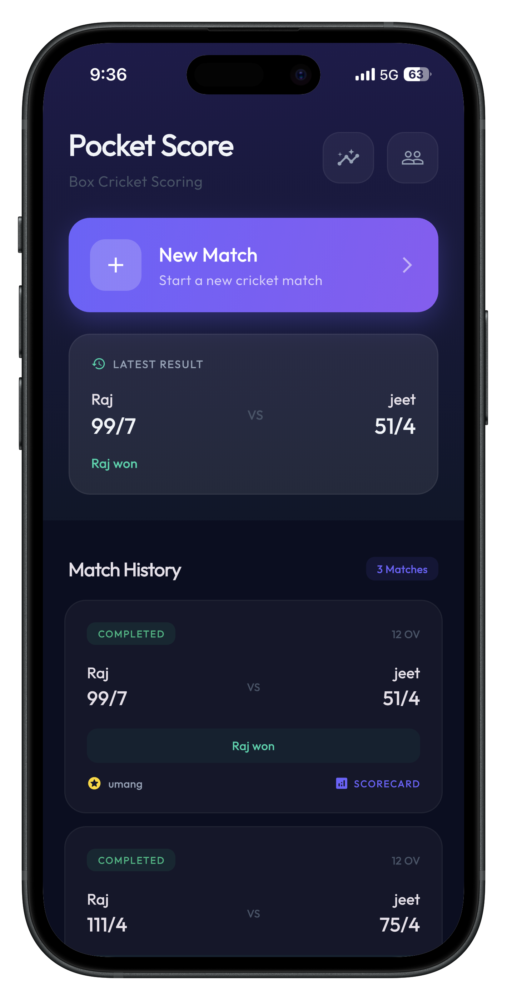 | 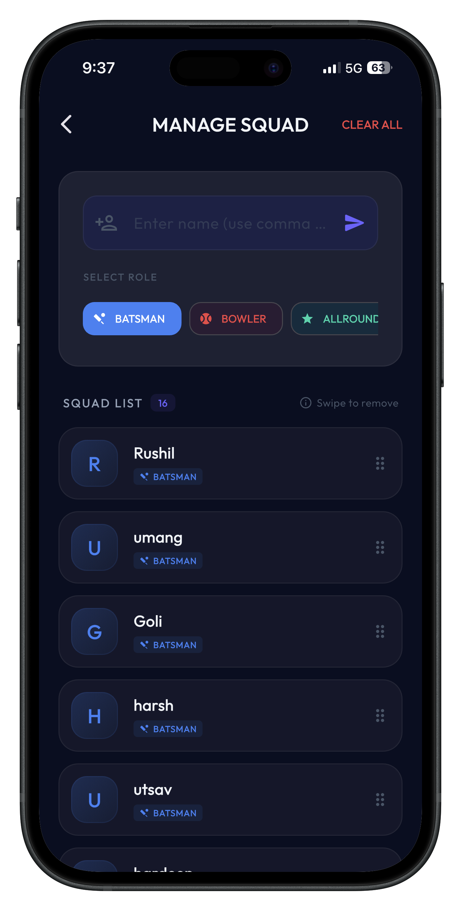 |

---

### ⚙️ Stage 2 — Match Setup & Team Selection

*Configure your match, assign players to teams, designate captains, and preview the final lineups before kickoff.*

| Match Setup | Select Teams | Lineup Preview |
| :---: | :---: | :---: |
| 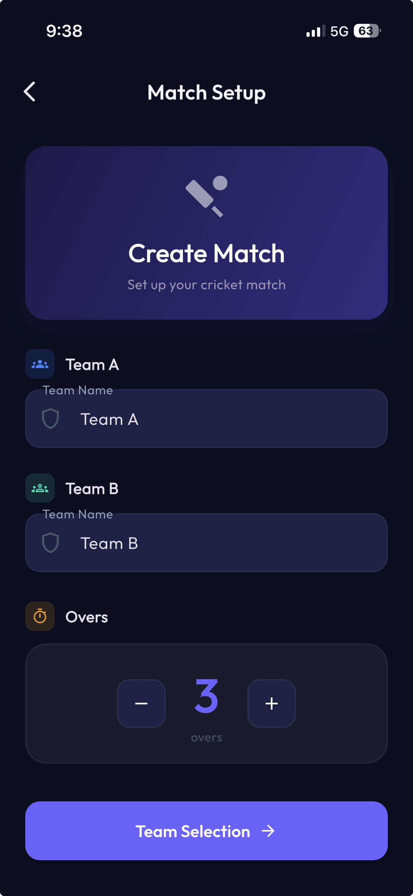 | 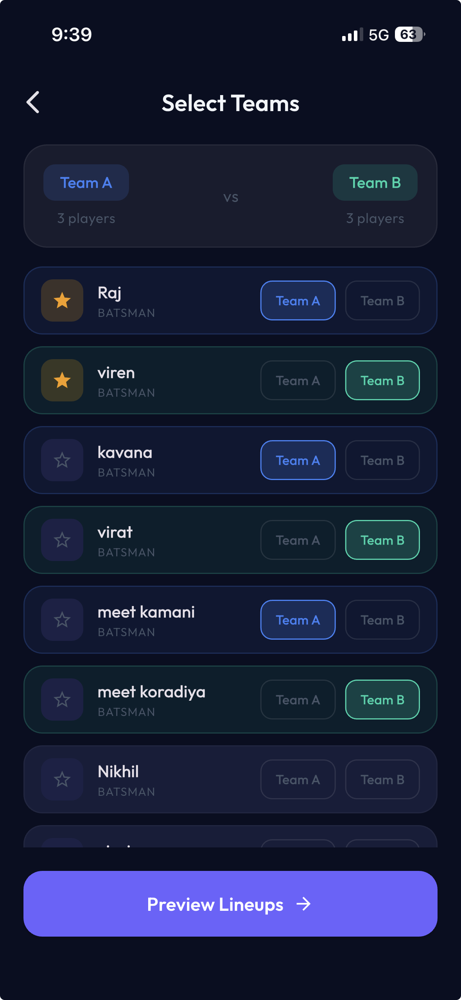 | 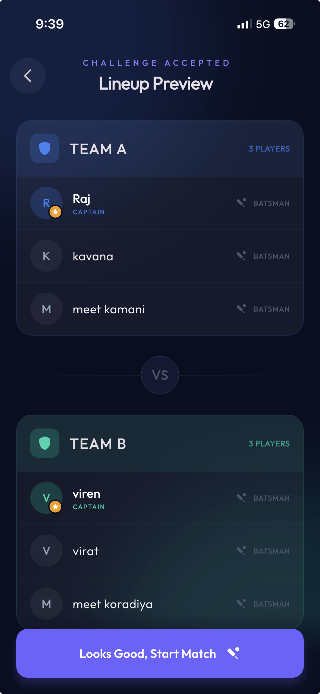 |

---

### 🪙 Stage 3 — Toss & Opening Selection

*The classic pre-match ritual. Toss the coin, choose to bat or bowl, and pick your opening striker, non-striker, and first bowler.*

| Coin Toss | Select Openers |
| :---: | :---: |
| 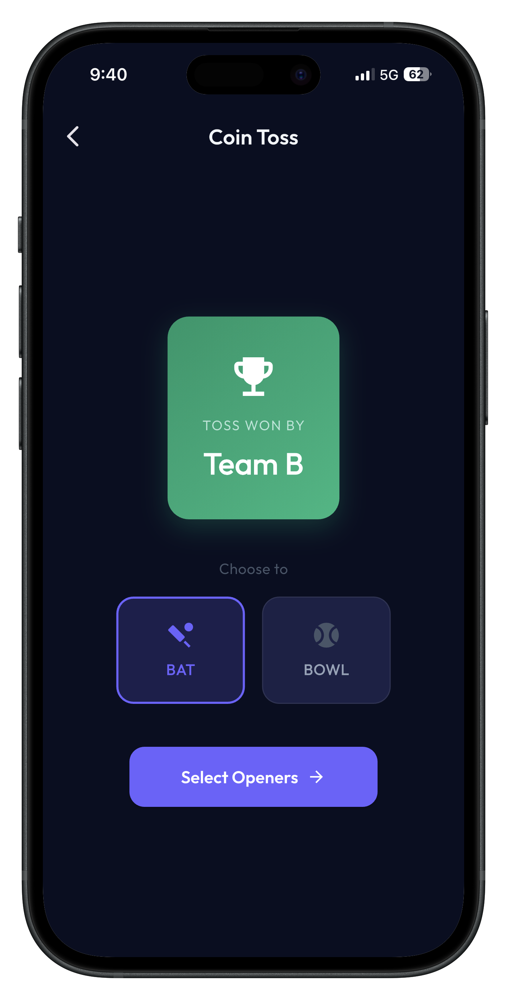 | 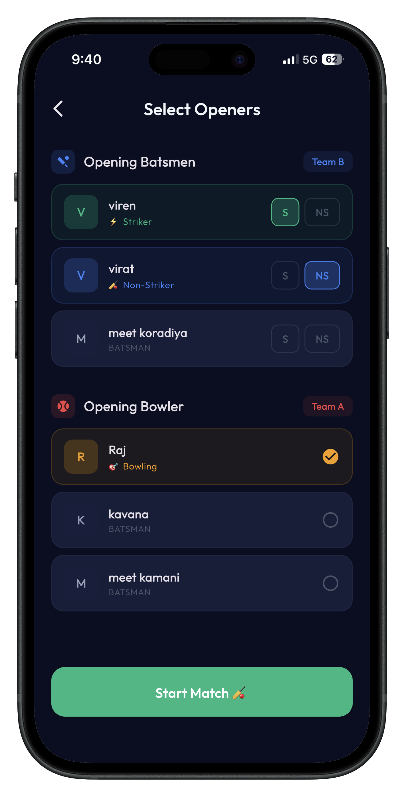 |

---

### 🎮 Stage 4 — Live Scoring Engine

*The heart of Pocket Score. Real-time ball-by-ball scoring with animated event overlays for every boundary, six, and wicket.*

| FOUR! 🟦 | SIX! 🟩 | OUT! 🟥 |
| :---: | :---: | :---: |
| 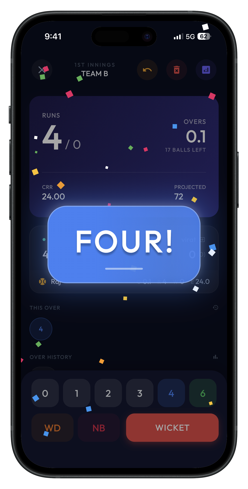 | 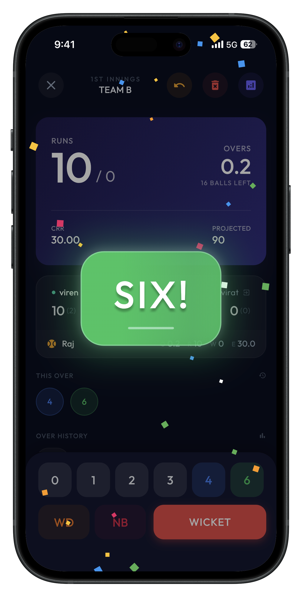 | 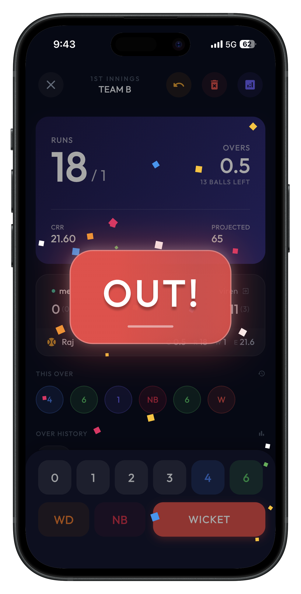 |

---

### 🎯 Stage 5 — Advanced In-Game Events

*Handle every cricket scenario with precision — wicket type selection, free hit & no-ball tracking, bowler rotation, and player retirement.*

| Wicket Type Selection | Free Hit / No-Ball | Select Next Bowler | Retire Player |
| :---: | :---: | :---: | :---: |
| 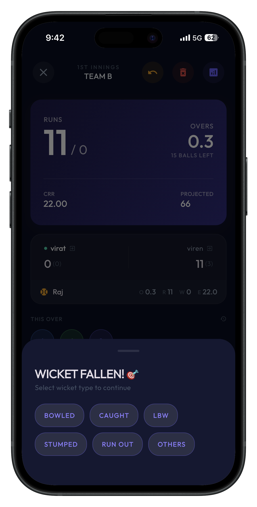 | 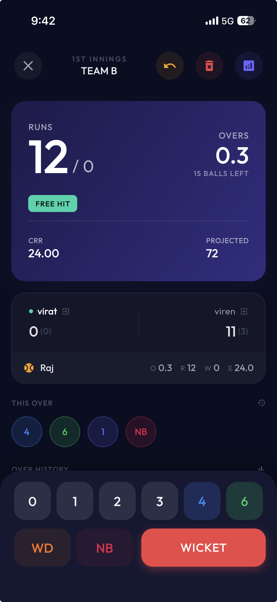 | 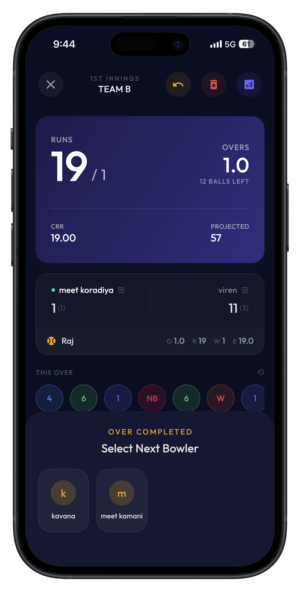 | 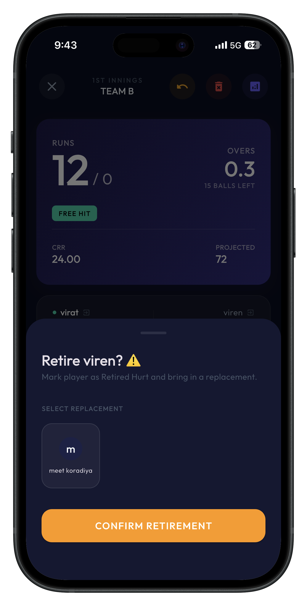 |

---

### 🏆 Stage 6 — Results & Rankings

*Match concluded — view the winner announcement with full scorecard access, then check the career-wide player rankings leaderboard.*

| Match Finished | Player Rankings |
| :---: | :---: |
| 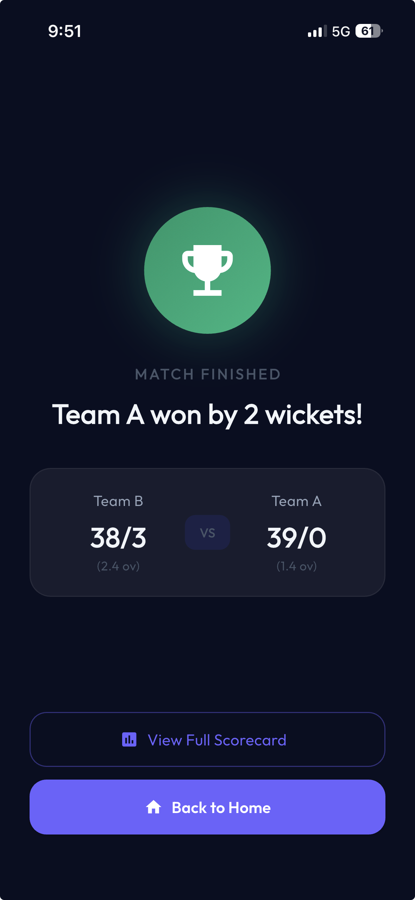 | 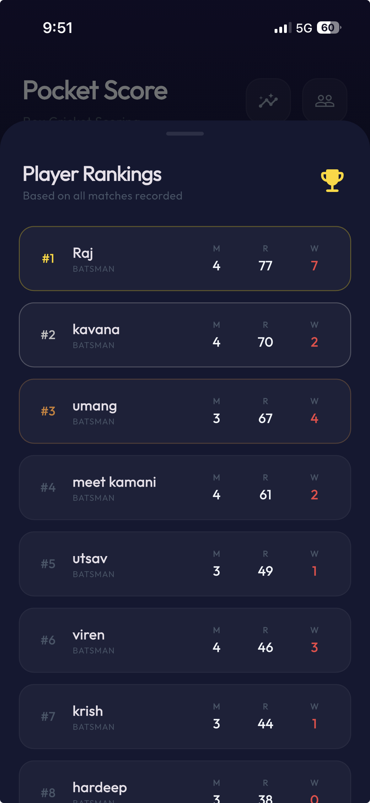 |

---

## 📝 License

This project is licensed under the MIT License — see the [LICENSE](LICENSE) file for details.

---

<div align="center">

Built with ❤️ for the Cricket Community

*"Every ball matters. Every run counts."*

</div>
